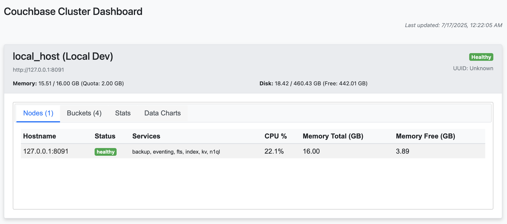
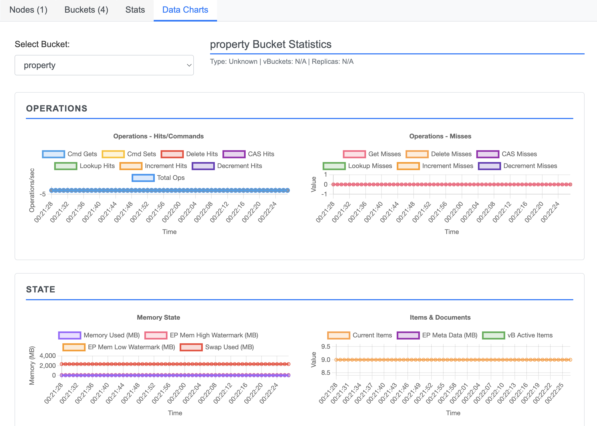

# Couchbase Cluster Dashboard

A Python web application that monitors multiple Couchbase clusters with real-time updates, advanced timeout handling, and comprehensive operations metrics.





## Features

### Core Functionality
- **Multi-Cluster Monitoring**: Monitor unlimited Couchbase clusters simultaneously
- **Custom Cluster Names**: Add friendly names to clusters alongside system names
- **Advanced Timeout Handling**: Non-blocking requests - fast clusters display immediately without waiting for slow ones
- **Real-time Updates**: Auto-refresh every 10 seconds with live data
- **Async Architecture**: Concurrent requests to all clusters and buckets for optimal performance

### Dashboard Views
- **Cluster Overview**: Health status, memory/disk usage, and node information
- **Operations Metrics**: Detailed command tracking (cmd_gets, cmd_sets, delete_hits, cas_hits, lookup_hits, increment_hits, decrement_hits)
- **Miss Analytics**: Comprehensive miss tracking for all operation types
- **Bucket Management**: Memory allocation, quota usage, eviction policies, and durability settings
- **System Statistics**: Human-readable formatting with automatic unit conversion (MB/GB, percentages)

### Interactive Interface
- **Draggable Cards**: Reorder clusters via drag-and-drop
- **Responsive Charts**: Real-time visualization of operations and system metrics using Chart.js
- **Tabbed Navigation**: Organized data display across Nodes, Buckets, Stats, and Charts
- **Error Resilience**: Clear error reporting for failed connections without blocking other clusters

## Installation

1. Clone the repository:
```bash
git clone <repository-url>
cd cb_quick_dashboard
```

2. Install dependencies:
```bash
pip install -r requirements.txt
```

3. Configure your clusters in `config.json`:
```json
[
    {
        "host": "http://127.0.0.1:8091",
        "user": "Administrator",
        "pass": "password",
        "customName": "Local Development"
    },
    {
        "host": "http://production.example.com:8091",
        "user": "Administrator",
        "pass": "secure_password",
        "customName": "Production Cluster"
    }
]
```

4. Run the application:
```bash
python app.py
```

5. Open http://localhost:5000 in your browser

## Configuration

### config.json Structure
Each cluster configuration supports:
- `host`: Couchbase cluster URL (required)
- `user`: Authentication username (required)
- `pass`: Authentication password (required)
- `customName`: Friendly display name (optional)

### Timeout Settings
- **Cluster timeout**: 15 seconds per cluster
- **Bucket operations**: 10 seconds per cluster
- **Individual timeouts**: Each cluster operates independently

## API Endpoints

- `GET /` - Main dashboard page
- `GET /api/clusters` - JSON API for all cluster data
- `GET /api/bucket/<cluster_host>/<bucket_name>/stats` - Detailed bucket statistics

## Dashboard Tabs

### Nodes Tab
- Server hostnames with direct links to Couchbase UI
- Health status indicators
- Service assignments (data, index, query, etc.)
- CPU utilization and memory statistics

### Buckets Tab
- **Memory Management**: Quota allocation (MB), quota usage percentage
- **Performance**: Operations per second, disk fetches
- **Configuration**: Eviction policy, durability minimum level
- **Storage**: Replica count, storage backend type

### Stats Tab
- **Human-readable formatting**: Automatic conversion to MB/GB
- **Percentage indicators**: All rates and ratios display with % symbols
- **System metrics**: CPU, memory, and network statistics

### Data Charts Tab
- **Operations Charts**: Real-time tracking of all command types and their corresponding misses
- **Memory State**: Usage, watermarks, and swap statistics
- **Disk Analytics**: Size, fragmentation, commit operations, and queue statistics
- **Performance Metrics**: Connections, CPU utilization, and resident ratios

## Technical Architecture

### Backend (Flask + aiohttp)
- Asynchronous request handling for optimal performance
- Individual cluster timeout management
- Exception handling that doesn't block other operations
- Comprehensive error logging and reporting

### Frontend (jQuery + Chart.js)
- Real-time chart updates without page refresh
- Responsive design with Bootstrap 4
- Dynamic bucket selection for detailed metrics
- Drag-and-drop cluster reordering with jQuery UI

### Data Processing
- Automatic unit conversion (bytes → MB/GB)
- Calculated metrics (total operations from individual commands)
- Time-series data visualization with 60-second rolling windows

## Performance Features

- **Non-blocking Architecture**: Fast clusters display immediately
- **Concurrent Processing**: All API calls execute in parallel
- **Smart Caching**: Efficient data updates without full page reloads
- **Error Isolation**: Failed clusters don't impact others
- **Timeout Management**: Prevents hanging on unresponsive clusters

## Dependencies

- **Flask 2.3.3**: Web framework
- **aiohttp 3.9.5**: Async HTTP client for Couchbase API calls
- **Chart.js**: Real-time data visualization
- **jQuery UI**: Interactive interface components
- **Bootstrap 4**: Responsive styling

## Browser Compatibility

Tested and supported on:
- Chrome/Edge (latest)
- Firefox (latest)
- Safari (latest)

## Troubleshooting

### Common Issues
1. **Slow loading**: Check cluster connectivity and adjust timeout settings
2. **Missing data**: Verify Couchbase credentials and network access
3. **Chart not updating**: Ensure bucket statistics are enabled in Couchbase

### Log Monitoring
The application provides detailed logging for:
- Connection timeouts
- Authentication failures
- Bucket access errors
- API response issues
