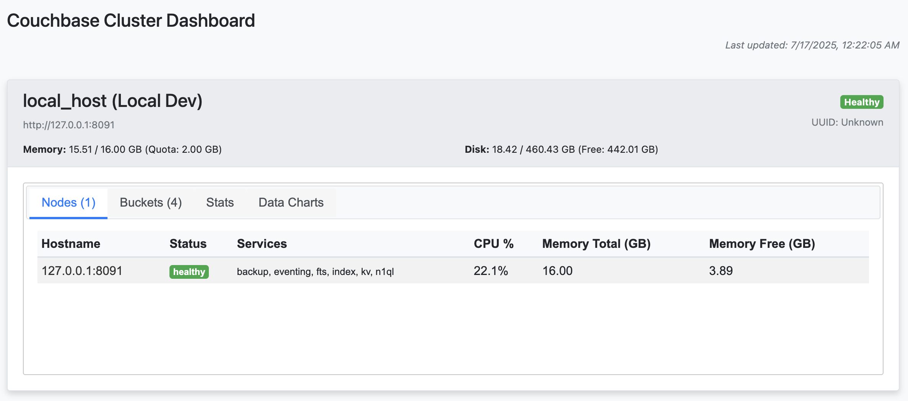
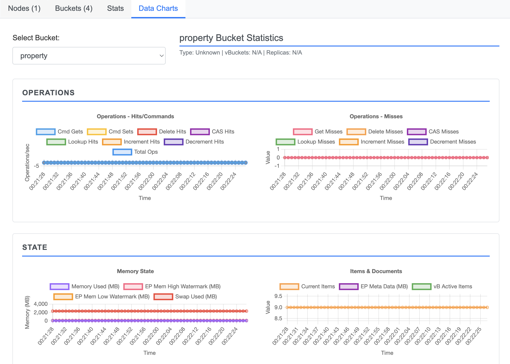

# Couchbase Cluster Dashboard

A local Python web app for monitoring one or more Couchbase clusters — health, buckets, ops metrics, XDCR, indexes, and live charts — with timeouts so slow clusters don’t block the rest.





##### Version **1.3.0** — full changelog in [RELEASE_NOTES.md](RELEASE_NOTES.md) · roadmap in [IMPROVEMENT_PLAN.md](IMPROVEMENT_PLAN.md)

**Default URL:** [http://127.0.0.1:5050](http://127.0.0.1:5050) (binds localhost only)

---

## What’s new in 1.1 – 1.3

| Version | Highlights |
|--------|------------|
| **1.3.0** | **Settings gear** (upper right): edit `config.json` in the browser — add/remove clusters, **Test** connection, watch toggle, poll interval, logging. APIs: `/api/config`, `/api/config/test`, `/api/meta`. |
| **1.2.0** | **Chart history** up to 30 minutes (built from poll samples). **Time range** on Data Charts: **1 / 5 / 15 / 30** minutes. X-axis spans the full selected window. |
| **1.1.0** | Default listen **`127.0.0.1:5050`** (avoids busy port 5000). CLI `--host` / `--port`, env `CB_DASHBOARD_HOST` / `CB_DASHBOARD_PORT`. `config.example.json`. |

---

## Features

### Core
- **Multi-cluster** monitoring with per-cluster `watch` on/off
- **Custom names** via `customName`
- **Non-blocking** async fetches (per-cluster timeouts)
- **Configurable poll interval** (default 10s; 5–300s via settings or config)
- **In-app config editor** (gear icon) — no need to hand-edit JSON for day-to-day cluster changes

### Views
- **Nodes** — services, health, links to Couchbase UI  
- **Buckets** — quota, ops, eviction, durability, replicas  
- **Stats** — human-readable system metrics  
- **Indexes** — GSI status  
- **XDCR** — remotes, tasks, ops/errors  
- **Data Charts** — ops/misses, memory, disk, DCP, XDCR series + **time range** selector  

### UI
- Settings **gear** (upper right) next to version badge  
- Draggable cluster cards  
- Chart.js visualizations, bucket selector, linear/log scale  
- Error isolation (one bad cluster doesn’t blank the dashboard)  

---

## Quick start (from source)

```bash
git clone https://github.com/Fujio-Turner/cb_quick_dashboard.git
cd cb_quick_dashboard

python3 -m venv venv
source venv/bin/activate          # Windows: venv\Scripts\activate
pip install -r requirements.txt

cp config.example.json config.json
# edit clusters (or do it later via the gear UI)

python app.py
# → Open: http://127.0.0.1:5050
```

Browser: open the URL printed at startup, then use the **gear** to add clusters and **Test** credentials.

### Port / host overrides

Port **5000** is often taken. Defaults are **host `127.0.0.1`**, **port `5050`**.

```bash
python app.py --port 5060
python app.py --host 127.0.0.1 --port 5080
CB_DASHBOARD_PORT=5070 python app.py
CB_DASHBOARD_HOST=127.0.0.1 CB_DASHBOARD_PORT=5090 python app.py
```

**Precedence:** CLI `--host` / `--port` → env `CB_DASHBOARD_HOST` / `CB_DASHBOARD_PORT` → `config.json` `server.*` → defaults.

Optional: `CB_DASHBOARD_CONFIG=/path/to/config.json` to point at another file.

---

## Executables

Pre-built binaries: [Releases](https://github.com/Fujio-Turner/cb_quick_dashboard/releases/)

1. Download and unzip for your OS  
2. Copy/edit `config.json` (or start the app and use the gear UI)  
3. Run `./cb_dashboard` (or `cb_dashboard.exe` on Windows)  
4. Open **http://127.0.0.1:5050** (or the port in your config)  

Example startup:

```text
Couchbase Dashboard v1.3.0
Open: http://127.0.0.1:5050
Listen: host=127.0.0.1 (config), port=5050 (config), debug=False (config)
 * Running on http://127.0.0.1:5050
```

> Flask’s built-in server is intended for **local** use, not public production.

---

## Configuration

### In-browser (recommended)

1. Open the dashboard  
2. Click the **gear** (upper right)  
3. Edit **Polling & server**, **Logging**, and **Clusters**  
4. Use **Test** on a row to verify host/user/password  
5. **Save to config.json**  

Notes:
- Passwords display as `********`. Leave that value to keep the existing secret; type a new password only when changing it.  
- **Poll interval** applies immediately after save.  
- **Bind host/port** are written to the file but take effect on the **next process restart**.  
- This UI is meant for a **localhost** dashboard (no login on the settings API).

### config.json (file)

Start from the example:

```bash
cp config.example.json config.json
```

```json
{
    "server": {
        "host": "127.0.0.1",
        "port": 5050,
        "debug": false,
        "poll_interval_seconds": 10
    },
    "logging": {
        "level": "info",
        "file": "logs/app.log",
        "enabled": true
    },
    "clusters": [
        {
            "host": "http://127.0.0.1:8091",
            "user": "Administrator",
            "pass": "password",
            "customName": "Local Development",
            "watch": true
        },
        {
            "host": "http://production.example.com:8091",
            "user": "Administrator",
            "pass": "secure_password",
            "customName": "Production Cluster",
            "watch": false
        }
    ]
}
```

#### `server`
| Key | Default | Description |
|-----|---------|-------------|
| `host` | `127.0.0.1` | Bind address (localhost-only by default) |
| `port` | `5050` | HTTP port |
| `debug` | `false` | Flask debug mode |
| `poll_interval_seconds` | `10` | Dashboard refresh interval (**5–300**) |

#### `logging`
| Key | Description |
|-----|-------------|
| `level` | `trace` / `debug` / `info` / `warning` / `error` |
| `file` | Log file path (directory created if needed) |
| `enabled` | File logging on/off (console always on) |

#### `clusters[]`
| Key | Required | Description |
|-----|----------|-------------|
| `host` | yes | `http://` or `https://` + host + mgmt port (usually **8091**) |
| `user` | yes | REST username |
| `pass` | yes | REST password |
| `customName` | no | Label in the UI |
| `watch` | no | `true` (default) to poll; `false` shows “Not Watching” |

### Timeouts (fetch)
- ~15s per cluster  
- ~10s per HTTP call / bucket gather  
- Clusters fail independently  

---

## Data Charts & history

- Each poll merges bucket stat samples into a **client-side history** (up to **30 minutes**).  
- **Time range** control: **1 / 5 / 15 / 30** minutes.  
- The **x-axis always spans** the selected window (even if only a short history is filled yet).  
- Preference is stored in `localStorage`.  
- Leave the page open to accumulate longer history; a hard refresh clears the in-memory buffer.

---

## API endpoints

| Method | Path | Description |
|--------|------|-------------|
| `GET` | `/` | Dashboard HTML |
| `GET` | `/api/meta` | Version, poll interval, config path (no secrets) |
| `GET` | `/api/config` | Full config for settings UI (passwords masked) |
| `PUT`/`POST` | `/api/config` | Save config.json |
| `POST` | `/api/config/test` | Test one cluster `{host,user,pass}` |
| `GET` | `/api/clusters` | Live cluster payload for cards/charts |
| `GET` | `/api/bucket/<host>/<bucket>/stats` | Bucket detail stats |
| `GET` | `/api/indexStatus` | Index status (watched clusters) |
| `GET` | `/api/xdcrStatus` | XDCR remotes + tasks |

---

## Dashboard tabs

### Nodes
Hostnames (links use cluster protocol/port), health, services, CPU/memory.

### Buckets
Quota, usage %, ops/sec, disk fetches, eviction, durability, replicas, backend.

### Stats
Formatted system metrics (MB/GB, percentages).

### Indexes
GSI / index status view.

### XDCR
Replication tasks, remotes, ops and error signals.

### Data Charts
Operations, misses, background ops, errors, memory/items/resident, connections/CPU, disk, DCP, XDCR — plus **time range** and chart scale (linear/log).

---

## Architecture

| Layer | Stack |
|-------|--------|
| Backend | Flask + aiohttp (async fan-out to Couchbase REST) |
| Frontend | jQuery, jQuery UI, Bootstrap 4, Chart.js |
| Config | `config.json` (+ optional in-browser editor) |
| History | `static/js/chart_history.js` (browser ring buffer + window grid) |
| Settings UI | `static/js/config_ui.js` |

---

## Development & tests

```bash
source venv/bin/activate
pip install -r requirements.txt -r requirements-test.txt

# Python
python -m pytest tests/ -q

# JS (Node)
npm install
npm test
```

---

## Troubleshooting

| Issue | What to try |
|-------|-------------|
| Port in use | `python app.py --port 5060` or change `server.port` / gear UI (then restart) |
| Can’t connect to cluster | Gear → **Test** on that row; check host `http(s)://…:8091`, user/pass, VPN/firewall |
| Charts only show ~1 minute of *data* | History must accumulate while the page is open; x-axis still shows full selected range |
| Time range looks wrong after upgrade | Hard refresh (Cmd+Shift+R / Ctrl+Shift+R) |
| Settings save failed | Validation error in the modal status line; check host URLs start with `http://` or `https://` |
| Empty dashboard | Ensure at least one cluster has `watch: true` and credentials work |

Logs: `logs/app.log` (if file logging enabled) and the process console.

---

## Dependencies

- **Flask 2.3.3** — web server  
- **aiohttp 3.9.5** — async HTTP to Couchbase  
- **Chart.js**, **jQuery / jQuery UI**, **Bootstrap 4**, **Font Awesome** (CDN)  

## Browser support

Chrome/Edge, Firefox, Safari (current versions).

---

## Release notes

See **[RELEASE_NOTES.md](RELEASE_NOTES.md)** for the full catalog and version history (1.0 baseline through 1.3.0).

Older binary docs: [README_RELEASE.md](README_RELEASE.md) · testing notes: [README_TESTING.md](README_TESTING.md).
